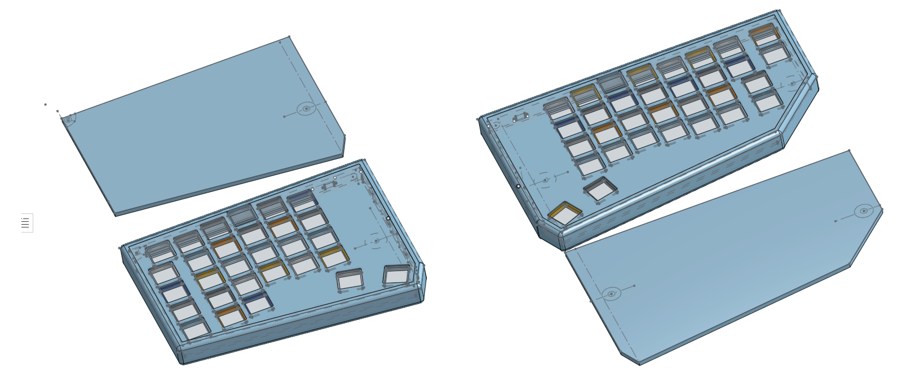
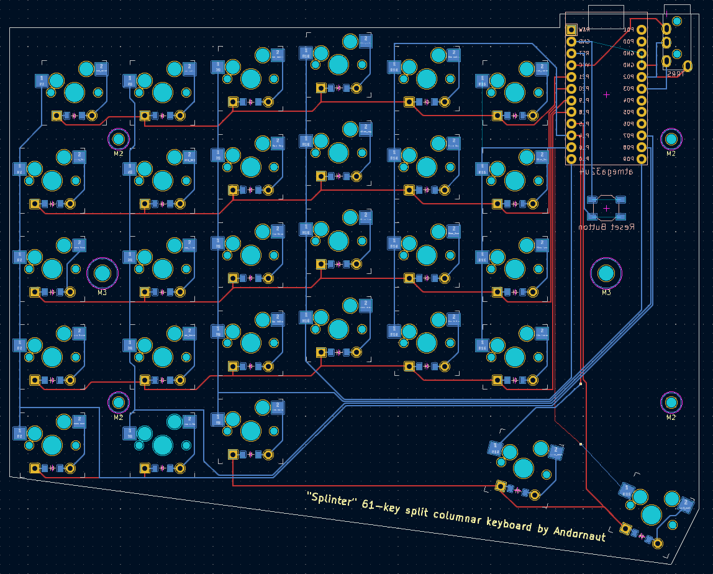

# Splinter keyboard

A 61-key split columnar keyboard.


* [@andornaut /til/3D Printing](https://github.com/andornaut/til/blob/master/docs/3d-printing.md)
* [@andornaut /til/Keyboards](https://github.com/andornaut/til/blob/master/docs/keyboards.md)

## Installation on Ubuntu

* [Setting Up Your QMK Environment](https://docs.qmk.fm/#/newbs_getting_started)

```
# Ergogen
nvm use
npm i

# KiCad
sudo add-apt-repository ppa:kicad/kicad-7.0-releases
sudo apt install kicad

# QMK
python3 -m pip install --user qmk
qmk setup -H ./qmk_firmware
```

## Building

### Ergogen

```
# Build ergogen
npm run build
ls dist
```
### QMK

* [Splinter qmk_firmware](https://github.com/andornaut/qmk_firmware/tree/splinter/keyboards/splinter)

```
qmk config \
    compile.keyboard=splinter \
    compile.keymap=default \
    flash.keyboard=splinter \
    flash.keymap=default \
    new_keyboard.keyboard=splinter \
    new_keyboard.keymap=default
qmk new-keyboard
qmk compile

# First time to set EEPROM handedness
qmk flash -bl avrdude-split-left
qmk flash -bl avrdude-split-right

# Thereafter
qmk flash
```

## Hardware

### atmega32u4

* [Pro Micro pinout](https://golem.hu/article/pro-micro-pinout/)

Arduino pins | AVR ports
---|---
1 (TX)  | D3
0 (RX)  | D2
GND     |
GND     |
2 (SDA) | D1
3 (SCL) | D0
4 (A6)  | D4
5       | C6
6 (A7)  | D7
7       | E6
8 (A8)  | B4
9 (A9)  | B5
10 (A10)| B6
14  | B3
15  | B1
16  | B2
A0 (18) | F7
A1 (19) | F6
A2 (20) | F5
A3 (21) | F4
VCC      |
RST      |
GND      |
RAW      |

### TRRS pinout

Left | Right
--- | ---
-- | VCC
-- | SDA (2/D1) (pull-up resistors to VCC) 
GND | SCL (3/D0) (pull-up resistors to VCC)

### Parts

* [1N4148 Diodes](https://keeb.io/collections/diy-parts/products/1n4148-diodes) x61
* [22AWG solid-core wire](https://www.pishop.ca/product/hook-up-wire-spool-set-22awg-solid-core-6-x-25-ft/)
* [4.7k ohm resistors](https://www.amazon.ca/dp/B00CVZ4B2U)
* [Cherry MX Ergo Clear](https://shockport.ca/collections/switches-1/products/cherry-mx-ergo-clear) ([developer information](https://www.cherrymx.de/en/dev.html)) x61
* [GMK Sixes keycaps](https://www.deskhero.ca/products/gmk-sixes) and [Ortho Kit](https://www.deskhero.ca/products/gmk-sixes?variant=39360309329986)
* [M3 screws](https://www.amazon.ca/gp/product/B01MZ3TWAF/)
* [M3 knurled nut inserts](https://www.amazon.ca/gp/product/B0B71QSH31/)
* [Monoprice Onyx TRRS Cable](https://www.monoprice.com/product?p_id=18632)
* [SparkFun Qwiic Pro Micro - USB-C (ATmega32U4)](https://www.sparkfun.com/products/15795) x2
  * Alternative: [Pro Micro (USB-C) - 5V/16MHz - ATmega32U4](https://keeb.io/products/pro-micro-usb-c-version-5v-16mhz-arduino-compatible-atmega32u4) and [Reset Pushbutton Switch](https://keeb.io/collections/diy-parts/products/reset-pushbutton-switch)
* [SparkFun Accessories TRRS jack (SMD)](https://www.mouser.ca/ProductDetail/474-PRT-12639) x2
  * Alternative: [TRRS PJ-320A Jack (3.5mm)](https://keeb.io/collections/diy-parts/products/trrs-jack-3-5mm)

### Dimensions

Part | Dimensions
--- | ---
[Keycap size](https://cdn.matt3o.com/uploads/2018/05/keycap-size-diagram.png) | 18mm²
Keycap size with padding | 19mm²
Switch (MX) cutout size | 14mm²
Switch (MX) outer size | 15.6mm²

## Design

### [Keyboard Layout](http://www.keyboard-layout-editor.com/)

* [Project folder](./keyboard-layout)
* [keyboard-layout.json](./keyboard-layout/keyboard-layout.json)


### [Ergogen](https://ergogen.cache.works/)

* [Project folder](./ergogen)
* [ergogen.yaml](./ergogen/ergogen.yaml)


### [OnShape](https://cad.onshape.com)

* [Project folder](./OnShape)



### [OrcaSlicer](https://github.com/SoftFever/OrcaSlicer)

* [Project folder](./OrcaSlicer)

### [KiCad](https://www.kicad.org/)

* [Project folder](./KiCad)


