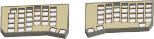

# Splinter keyboard

A 61-key split columnar ergonomic keyboard

* [andornaut@github /til](https://github.com/andornaut/til/)
  * [3D Printing](https://github.com/andornaut/til/blob/master/docs/3d-printing.md)
  * [Electronics](https://github.com/andornaut/til/blob/master/docs/electronics.md)
  * [Keyboards](https://github.com/andornaut/til/blob/master/docs/keyboards.md)
* [Splinter qmk_firmware](https://github.com/andornaut/qmk_firmware/tree/splinter/keyboards/splinter)

## Versions

Version | Description | Layout
--- | --- | ---
[v1](./v1) | Production ready. Asymetrical. Traditional 61-key layout. | [](./v1/v1.jpg)
[v2](./v2) | In development. Symmetrical cases. Non-traditional (moved backspace and backslash keys) 60-key layout. | [](./v2/v2.png)

## Installation

* [Ergogen](https://github.com/ergogen/ergogen)
  * [Footprints by infused-kim](https://github.com/infused-kim/kb_ergogen_fp)
  * [Footprints by sboysel](https://github.com/sboysel/ergogen/tree/develop/src/footprints)
  * [Helper scripts](https://github.com/infused-kim/kb_ergogen_helper)
* [KiCad](https://www.kicad.org)
  * [KiKit automation tools](https://github.com/yaqwsx/KiKit)
* [OrcaSlicer](https://github.com/SoftFever/OrcaSlicer)

```bash
# Include submodules when cloning
git clone --recursive git@github.com:andornaut/splinter-keyboard.git
cd splinter-keyboard

# Install dependencies, including Ergogen
nvm use
npm install

# Install KiCad
sudo add-apt-repository ppa:kicad/kicad-7.0-releases
sudo apt install kicad

# Install KiKit
# Must use the same Python interpreter as KiCad (will not work in a venv)
pip install kikit
```

## Developing

1. Set the `VERSION` environment variable in [`.env`](./.env) to one of "v1" or "v2"
1. Prototype a keyboard layout using [Keyboard Layout Editor](http://www.keyboard-layout-editor.com/)
1. Convert the prototype to a production-ready design using [Ergogen](https://github.com/ergogen/ergogen)
1. Design the PCBs using [KiCad](https://www.kicad.org/)
    * Print the PCBs using [JLCPCB](https://jlcpcb.com/), [OSH Park](https://oshpark.com/), or [PCBWay](https://www.pcbway.com/)
1. Model a case using [OnShape](https://cad.onshape.com)
1. Print the case using [OrcaSlicer](https://github.com/SoftFever/OrcaSlicer)
1. Install the [custom QMK firmware](https://github.com/andornaut/qmk_firmware/tree/splinter/keyboards/splinter)
