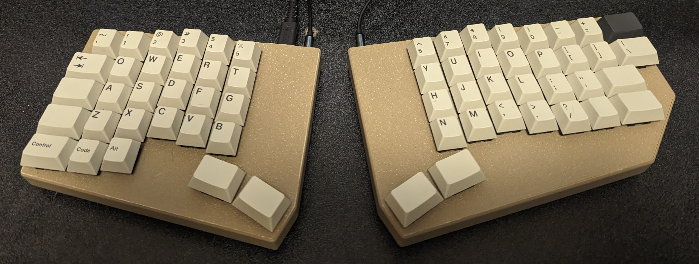
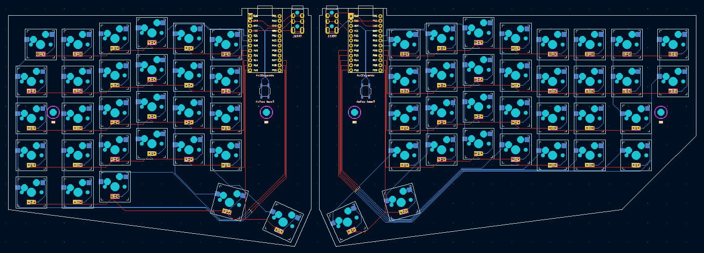
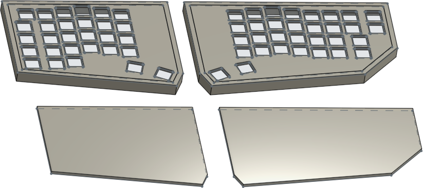

# Splinter keyboard

A 61-key split columnar keyboard.



* [andornaut@github /til](https://github.com/andornaut/til/)
  * [3D Printing](https://github.com/andornaut/til/blob/master/docs/3d-printing.md)
  * [Electronics](https://github.com/andornaut/til/blob/master/docs/electronics.md)
  * [Keyboards](https://github.com/andornaut/til/blob/master/docs/keyboards.md)
* [Splinter qmk_firmware](https://github.com/andornaut/qmk_firmware/tree/splinter/keyboards/splinter)

## Installation

* [Ergogen](https://github.com/ergogen/ergogen)
  * [kb_ergogen_helper](https://github.com/infused-kim/kb_ergogen_helper)
* [KiCad](https://www.kicad.org)
  * [KiKit automation tools](https://github.com/yaqwsx/KiKit)
* [OnShape](https://www.onshape.com/en/)
* [OrcaSlicer](https://github.com/SoftFever/OrcaSlicer)

```
# Include submodules when cloning
git clone --recursive git@github.com:andornaut/splinter-keyboard.git
cd splinter-keyboard

# Install dependencies, including Ergogen
nvm use
npm i

# Install KiCad
sudo add-apt-repository ppa:kicad/kicad-7.0-releases
sudo apt install kicad

# Install KiKit
# Must use the same Python interpreter as KiCad (will not work in a venv)
pip install kikit
```

## Hardware

### atmega32u4

* [Pro Micro pinout](https://golem.hu/article/pro-micro-pinout/)

Left Arduino | Left AVR | Right Arduino | Right AVR
---      |--- | ---      |---
1 (TX0)  | D3 | RAW      |
0 (RX1)  | D2 | GND      |
GND      |    | RST      |
GND      |    | VCC      |
2 (SDA)  | D1 | A3 (21)  | F4
3 (SCL)  | D0 | A2 (20)  | F5
4 (A6)   | D4 | A1 (19)  | F6
5        | C6 | A0 (18)  | F7
6 (A7)   | D7 | 15       | B1
7        | E6 | 14       | B3
8 (A8)   | B4 | 16       | B2
9 (A9)   | B5 | 10 (A10) | B6

### TRRS serial pinout

* [qmk_firmware/docs/feature_split_keyboard](https://github.com/qmk/qmk_firmware/blob/master/docs/feature_split_keyboard.md#serial-wiring)
* [qmk_firmware/docs/serial_driver](https://github.com/qmk/qmk_firmware/blob/master/docs/serial_driver.md)

Left | Right
--- | ---
-- | 0 (RX1, D2)
-- | GND
-- | VCC
-- | --

### Parts

Category | Quantity | Part
--- | --- | ---
Diodes | 61 | Hand wired: [1N4148 Diodes](https://keeb.io/collections/diy-parts/products/1n4148-diodes); PCB: [Nexperia PMEG100T10ELRX Diode 100 V 1A Surface Mount SOD-123W](https://www.digikey.ca/en/products/detail/nexperia-usa-inc/PMEG100T10ELRX/15777950)
Hot swap sockets | 61 | PCB: [Kailh Colorful Hot Swap Socket](https://www.aliexpress.com/item/1005003166749340.html)
Keycap sets || [GMK Sixes keycaps](https://www.deskhero.ca/products/gmk-sixes) and [Ortho Kit](https://www.deskhero.ca/products/gmk-sixes?variant=39360309329986)
Key switches | 61 | [Cherry MX Ergo Clear](https://shockport.ca/collections/switches-1/products/cherry-mx-ergo-clear) ([developer information](https://www.cherrymx.de/en/dev.html))
Microcontrollers | 2 | [Pro Micro (USB-C) - 5V/16MHz - ATmega32U4](https://keeb.io/products/pro-micro-usb-c-version-5v-16mhz-arduino-compatible-atmega32u4) or [SparkFun Qwiic Pro Micro - USB-C (ATmega32U4)](https://www.sparkfun.com/products/15795)
Reset buttons | 2 | [SparkFun COM-08720 switch](https://www.mouser.ca/ProductDetail/474-COM-08720) or [Reset Pushbutton Switch](https://keeb.io/collections/diy-parts/products/reset-pushbutton-switch) (not required when using [SparkFun Qwiic Pro Micro - USB-C (ATmega32U4)](https://www.sparkfun.com/products/15795) microcontrollers)
Screws | 4 | [M3 screws](https://www.amazon.ca/gp/product/B01MZ3TWAF/)
Sockets (12-pin)| 2 | [Mill-Max 315-43-112-41-003000](https://www.mouser.ca/ProductDetail/575-3154311241003000)
Socket pins | 24 | [Mill-Max 3320-0-00-15-00-00-03-0](https://www.mouser.ca/ProductDetail/575-3320000150000030)
Threaded inserts | 2 | [M3 5x4mm (width,height) brass threaded inserts](https://www.amazon.ca/uxcell-knurled-Threaded-Embedment-Printer/dp/B09MCWTBCC)
TRRS cables | 1 | [Monoprice Onyx TRRS Cable](https://www.monoprice.com/product?p_id=18632)
TRRS connectors | 2 | Optional, for custom cable: [SparkFun COM-15337 TRRS Audio Plug - 3.5 mm](https://www.mouser.ca/ProductDetail/474-COM-15337)
TRRS jacks | 2 | [TRRS PJ-320A Jack (3.5mm)](https://keeb.io/collections/diy-parts/products/trrs-jack-3-5mm) or [CUI Devices SJ-43514](https://www.digikey.ca/en/products/detail/cui-inc/SJ-43514/368146) or [SparkFun Accessories TRRS jack (SMD)](https://www.mouser.ca/ProductDetail/474-PRT-12639)
Wires || Hand wired: [22AWG solid-core wire](https://www.pishop.ca/product/hook-up-wire-spool-set-22awg-solid-core-6-x-25-ft/)

### Part dimensions

Part | Dimensions
--- | ---
[Keycap size](https://cdn.matt3o.com/uploads/2018/05/keycap-size-diagram.png) | 18mm²
[SparkFun Qwiic Pro Micro - USB-C (ATmega32U4)](https://www.sparkfun.com/products/15795) | PCB: width: 17.78mm, length: 33.02; USB: protrusion: 1.27mm
Keycap size with padding | 19mm²
Switch (MX) cutout size | 14mm²
Switch (MX) outer size | 15.6mm²

## Developing

Overall process:

1. Prototype a keyboard layout using [Keyboard Layout Editor](http://www.keyboard-layout-editor.com/)
1. Convert the prototype to a production-ready design using [Ergogen](https://github.com/ergogen/ergogen)
1. Design the PCBs using [KiCad](https://www.kicad.org/)
    * Print the PCBs using [JLCPCB](https://jlcpcb.com/), [OSH Park](https://oshpark.com/), or [PCBWay](https://www.pcbway.com/)
1. Model a case using [OnShape](https://cad.onshape.com)
1. Print the case using [OrcaSlicer](https://github.com/SoftFever/OrcaSlicer)

### [Keyboard Layout](http://www.keyboard-layout-editor.com/)

* [Project folder](./keyboard-layout-editor)
* [Configuration file](./keyboard-layout-editor/keyboard-layout.json)


1. Prototype a keyboard layout using [Keyboard Layout Editor](http://www.keyboard-layout-editor.com/)
1. Export the layout configuration to [`./keyboard-layout-editor/keyboard-layout.json`](./keyboard-layout-editor/keyboard-layout.json), so that you can import it and iterate on it in the future
1. Use the prototype as inspiration for creating a production-ready design using Ergogen

### [Ergogen](https://github.com/ergogen/ergogen)

* [Project folder](./ergogen)
* [Configuration file](./ergogen/config.yaml)


1. Convert the prototype to Ergogen's DSL, and then save it to [`./ergogen/config.yaml`](./ergogen/config.yaml)
1. Run `npm run build` to generate and save outlines and pcbs to `./dist/ergogen/`
    * Alternatively, run `npm run watch` or `npm run watch-and-copy-pcbs-to-kicad`

### [KiCad](https://www.kicad.org/)

* [Project folder](./kicad)



1. Run `npm run copy-pcbs-to-kicad` to copy the `./dist/ergogen/pcbs/*.kicad_pcb` files generated by Ergogen to [`./kicad/`](./kicad/)
1. Route the PCBs in [`./kicad/`](./kicad/), and then save them to [`./kicad/routed/`](./kicad/routed/)
    * If you've generated new PCB files using Ergogen, then you can run `npm run copy-traces` to copy traces from the PCBs in [`./kicad/routed/`](./kicad/routed/) back to those of the same name in [`./kicad/`](./kicad/)
1. Run `npm run fab-jlcpcb` to generate and save gerber and drill files to `./dist/kicad/jlcpcb/*.zip`
1. Submit the `./dist/kicad/jlcpcb/*.zip` files to [JLCPCB](https://jlcpcb.com/)

#### PCB dimensions

Position each PCB at (105,105). The left half starts at this position, but the right half must be moved before running `npm run copy-traces`. 100mm to provide a buffer around the edges of the document, and 5 mm to account for the case walls.

#### Configuration

Configuration | Description
--- | ---
Default netclass | Clearance: 0.25mm, Track width: 0.25mm
VCC netclass | Clearance: 0.25mm, Track width: 0.25mm

##### Left half

Overall (h,w): 122.1 mm, 155.5 mm

Edge | Start and end (x,y) coordinates
--- | ---
Left | (105,105) (105,205.5)
Top | (105,105) (260.5,105)
Right | (260.5,105) (260.5,208.8)
Corner | (253.4,224.1) (260.5,208.8)
Bottom | (105,205.5) (253.4,224.1)
PCB edge to center of M3 hole | 23mm (28mm to outer wall)

##### Right half

Overall (h,w): 122.1 mm, 193.6 mm

Edge | Start and end (x,y) coordinates
--- | ---
Left | (105,105) (105,208.8)
Top | (105,105) (298.6,105)
Right | (298.6, 105) (298.6,167.1)
Right corner | (263,205.2) (298.6,167.1)
Buttom | (112,224.1) (263,205.2)
Left corner | (105, 208.8) (112,224.1)
PCB outside edge to center of M3 hole | 18mm (23mm to outer wall)

### [OnShape](https://cad.onshape.com)

* [Project folder](./onshape)



1. Create a new document
1. Start a new sketch
1. Import one of the `./dist/ergogen/outlines/*.dxf` files generated by Ergogen
1. Design a keyboard case
1. Export `*.step` files to [`./onshape/`](./onshape/)

#### Dimensions

##### Left half

Overall dimensions (h,w): 129.51474 mm, 165.5 mm

Edge | Length
--- | ---
Left | 110 mm
Top | 165.5 mm
Right | 110 mm
Corner | 21.53214 mm
Bottom | 157.61289 mm

##### Right half

Overall dimensions (h,w): 129.51474 mm, 203.6 mm

Edge | Start and end (x,y) coordinates
--- | ---
Left | 110 mm
Top | 203.6 mm
Right | 110 mm
Right corner | 55.85994 mm
Buttom | 157.61289 mm
Left corner | 21.53214 mm

### [OrcaSlicer](https://github.com/SoftFever/OrcaSlicer)

* [Project folder](./orcaslicer)
* [Project file](./orcaslicer/splinter.3mf)

1. Open the [`./orcaslicer/splinter.3mf`](./orcaslicer/splinter.3mf) project file
1. Import `*.step` files from [`./onshape/`](./onshape/)
1. Print the keyboard case

### [QMK Firmware](https://qmk.fm/)

See [the "splinter" fork of qmk_firmware](https://github.com/andornaut/qmk_firmware/tree/splinter/keyboards/splinter).
