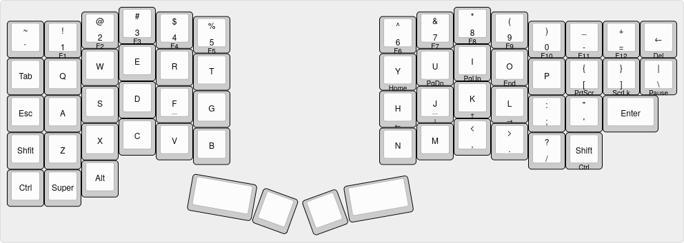
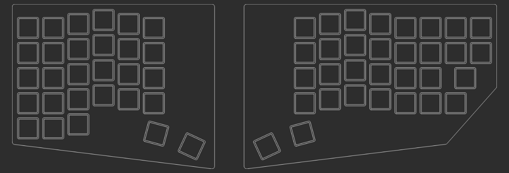

# Keyboards

* [@andornaut /til/3D Printing](https://github.com/andornaut/til/blob/master/docs/3d-printing.md)
* [@andornaut /til/Keyboards](https://github.com/andornaut/til/blob/master/docs/keyboards.md)

## Parts and supplies

* [1N4148 Diodes](https://keeb.io/collections/diy-parts/products/1n4148-diodes)
* [22AWG solid-core wire](https://www.pishop.ca/product/hook-up-wire-spool-set-22awg-solid-core-6-x-25-ft/)
* [63/37 lead rosin core solder](https://www.pishop.ca/product/solder-wire-63-37-tin-lead-sn63-pb37-no-clean-water-washable-031-2oz/)
* [Cherry MX Ergo Clear](https://shockport.ca/collections/switches-1/products/cherry-mx-ergo-clear) ([developer information](https://www.cherrymx.de/en/dev.html))
* [GMK Sixes keycaps](https://www.deskhero.ca/products/gmk-sixes) and [Ortho Kit](https://www.deskhero.ca/products/gmk-sixes?variant=39360309329986)
* [Liquid flux pen](https://www.pishop.ca/product/liquid-flux-no-clean-in-10ml-pen-w-tip/)
* [M2 screws (6mm)](https://keeb.io/collections/diy-parts/products/m2-screws-and-standoffs?variant=12490111582302)
* [M2 standoffs (11mm)](https://keeb.io/collections/diy-parts/products/m2-screws-and-standoffs?variant=47432051654)
* [Pro Micro (USB-C) - 5V/16MHz - ATmega32U4](https://keeb.io/products/pro-micro-usb-c-version-5v-16mhz-arduino-compatible-atmega32u4) x2
* [Reset Pushbutton Switch](https://keeb.io/collections/diy-parts/products/reset-pushbutton-switch) x2
* [TRRS Cable](https://keeb.io/collections/diy-parts/products/trrs-cable?variant=46391966470)
* [TRRS PJ-320A Jack (3.5mm)](https://keeb.io/collections/diy-parts/products/trrs-jack-3-5mm) x2
* [Tribosys 3203](https://shockport.ca/collections/lubes-and-films/products/tribosys-3203)
* [USB-C Breakout Board](https://keeb.io/collections/diy-parts/products/usb-c-breakout-board)

## Installation on Ubuntu

```
# Ergogen
nvm use
npm i

# KiCad
sudo add-apt-repository ppa:kicad/kicad-7.0-releases
sudo apt install kicad
```

## Getting started

```
npm run build
ls dist
```

## v0

Question | Answer
--- | ---
Keycap material | ABS double shot
Keycap profile | Cherry
[Keycap size](https://cdn.matt3o.com/uploads/2018/05/keycap-size-diagram.png) | 18mm²
Keycap size with padding | 19mm²
Switch (MX) cutout/hole | 14mm²
Switch (MX) outer size | 15.6mm²

### Keyboard Layout

* [keyboard-layout.json](./v0/keyboard-layout/keyboard-layout.json)



### Ergogen

* [Project folder](./v0/ergogen)
* [ergogen.yaml](./v0/ergogen/ergogen.yaml)



### OnShape

* [Project folder](./v0/OnShape)

### BambuStudio

* [Project folder](./v0/BambuStudio)

### KiCad

* [Project folder](./v0/KiCad)


