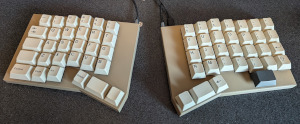
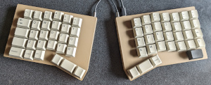
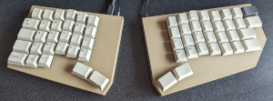
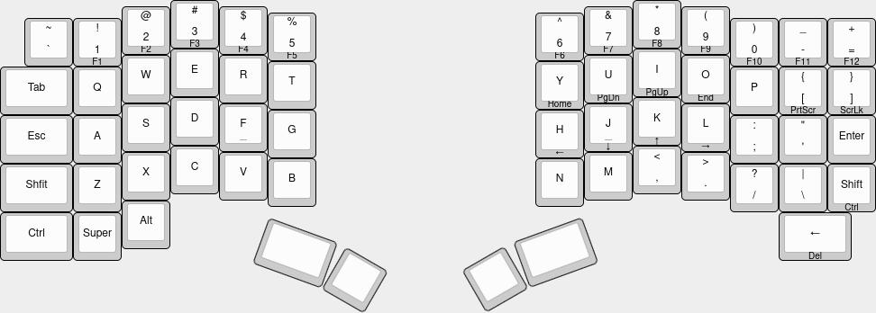
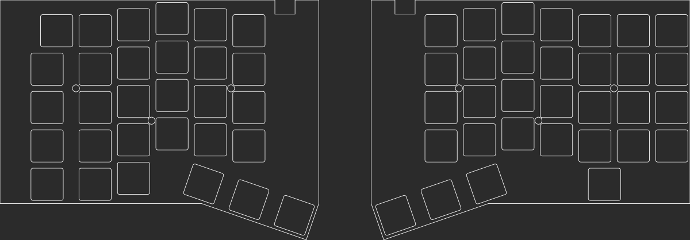
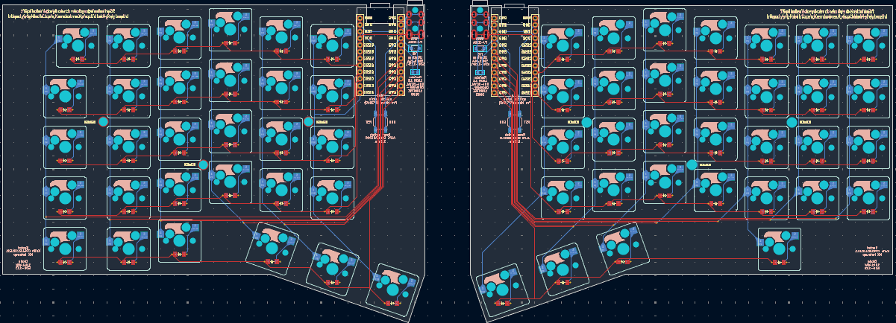

# Splinter keyboard

A 62-key split columnar ergonomic keyboard.

This repo holds the hardware design files. The design pipeline is: Keyboard Layout Editor -> Ergogen -> KiCad -> Fabrication -> Onshape -> OrcaSlicer -> QMK firmware (see [Developing](#developing)).

* [QMK firmware](https://github.com/andornaut/qmk_firmware/tree/splinter/keyboards/splinter)
* [andornaut@github /til](https://github.com/andornaut/til/)
  * [3D Printing](https://github.com/andornaut/til/blob/master/docs/3d-printing.md)
  * [Electronics](https://github.com/andornaut/til/blob/master/docs/electronics.md)
  * [Keyboards](https://github.com/andornaut/til/blob/master/docs/keyboards.md)

## Versions

| Version | MCU | Changes from previous | Firmware | Photo |
| --- | --- | --- | --- | --- |
| [v4](./v4) | [splitkb Liatris](https://splitkb.com/products/liatris) (RP2040) | Added USB VBUS detection and TRRS data-line protection | [splinter](https://github.com/andornaut/qmk_firmware/tree/splinter/keyboards/splinter) | [](./v4/v4.jpg) |
| [v3](./v3) | [Adafruit KB2040](https://www.adafruit.com/product/5302) (RP2040) | Switched from AVR to RP2040 | [splinter-v3.0](https://github.com/andornaut/qmk_firmware/tree/splinter-3.0/keyboards/splinter) | [](./v3/v3.jpg) |
| [v2](./v2) | [SparkFun Pro Micro](https://www.sparkfun.com/products/15795) (ATmega32U4) | Symmetrical enclosures; added a key (62 keys) | [splinter-v2.0](https://github.com/andornaut/qmk_firmware/tree/splinter-2.0/keyboards/splinter) | [](./v2/v2.jpg) |
| [v1](./v1) | [SparkFun Pro Micro](https://www.sparkfun.com/products/15795) (ATmega32U4) | Initial version: 61 keys, columnar layout, asymmetrical enclosures | [splinter-v1.0](https://github.com/andornaut/qmk_firmware/tree/splinter-1.0/keyboards/splinter) | [](./v1/v1.jpg) |

## Installation

Install the following tools:

* [KiCad 10](https://www.kicad.org)
* [Node.js](https://nodejs.org) via [nvm](https://github.com/nvm-sh/nvm)
* [OrcaSlicer](https://github.com/SoftFever/OrcaSlicer) - 3D printing slicer
* [Python 3](https://www.python.org)
* [Freerouting](https://github.com/freerouting/freerouting) (optional)
* [KiKit](https://github.com/yaqwsx/KiKit) (optional, for `npm run panelize`; needs the git-master build, see below)

```bash
# Include submodules when cloning
git clone --recursive git@github.com:andornaut/splinter-keyboard.git
cd splinter-keyboard

# Install the Node version from .nvmrc, then the deps (including Ergogen)
nvm install
npm install

# Install KiCad 10 (provides kicad-cli, used for fab file generation)
# Or use the Ansible task: https://github.com/andornaut/ansible-ctrl/blob/main/roles/hobbies/tasks/electronics.yml
sudo add-apt-repository ppa:kicad/kicad-10.0-releases
sudo apt install kicad

# Fallback only if you cloned without --recursive: fetch the submodules
git submodule update --init --recursive
```

Alternatively, you can install OrcaSlicer, KiCad, and Freerouting using [these Ansible tasks](https://github.com/andornaut/ansible-ctrl/blob/main/roles/hobbies/tasks/main.yml) (tags `orcaslicer`, `kicad`, `freerouting`).

### Updating footprint submodules

`npm run build` uses the vendored footprint submodules (`ceoloide`, `infused-kim`) at their pinned revision and does not advance them, so builds stay reproducible. To pull the latest upstream footprints and re-pin them:

```bash
git submodule update --remote ergogen/footprints/ceoloide ergogen/footprints/infused-kim
git add ergogen/footprints/ceoloide ergogen/footprints/infused-kim
git commit -m "Bump footprint submodules"
```

## Developing

### Step 1. Configure the environment

Set the active version in [`package.json`](./package.json) under `config.VERSION` to one of v1, v2, v3, or v4, either by editing the file or with `npm pkg set config.VERSION=v3`.

### Step 2. [Keyboard Layout Editor](http://www.keyboard-layout-editor.com/)



1. Prototype a layout in [Keyboard Layout Editor](http://www.keyboard-layout-editor.com/).
1. Export it to [`keyboard-layout-editor/keyboard-layout-editor.json`](./v4/keyboard-layout-editor/keyboard-layout-editor.json) so you can re-import and iterate later.
1. Use it as the basis for the production Ergogen design.

### Step 3. [Ergogen](https://github.com/ergogen/ergogen)



1. Run `docker compose up` to start the Ergogen GUI (it builds automatically), then open <http://ergogen.internal> (needs [docker_etc_hosts](https://github.com/andornaut/docker_etc_hosts) for the `/etc/hosts` entry).
1. Paste in, edit, then download [`ergogen/config.yaml`](./v4/ergogen/config.yaml).
1. Run `npm run build` to generate outlines and PCBs into `dist/v4/ergogen/`, then `npm run copy-pcbs-dist-to-unrouted`. Or use `npm run watch` / `npm run watch-and-copy-pcbs-to-unrouted`.

**Notes:**

* The GUI prototypes key placement, layout, and outlines but does not render PCBs. It runs client-side only (no filesystem access, no sync), so edit there and copy back to `config.yaml`, the source of truth. Use `npm run build` for full builds and PCB generation.
* Custom footprints are baked into the GUI image via the [`Dockerfile`](./Dockerfile) since the browser can't load them from disk. It registers this repo's footprints (`mcu_liatris`, `sod-123fl`, `sod-123w`) on top of the upstream `ceoloide` and `infused-kim` libraries; any unregistered `what:` shows up as unknown. After adding one, rebuild with `docker compose build --no-cache`.

### Step 4. [KiCad](https://www.kicad.org/)



1. Copy Ergogen's generated boards into [`kicad/unrouted/`](./v4/kicad/unrouted/) with `npm run copy-pcbs-dist-to-unrouted` (existing boards are first backed up to gitignored `kicad/backups/<name>-<timestamp>.kicad_pcb`), then open one in KiCad, e.g. [`left.kicad_pcb`](./v4/kicad/unrouted/left.kicad_pcb).
1. Route the boards in [`kicad/unrouted/`](./v4/kicad/unrouted/). Once routing is done, clean each board up before saving:
   * **Cleanup Tracks & Vias** (Tools > Cleanup Tracks & Vias): enable all options to merge collinear segments, delete redundant/dangling tracks and vias, and remove tracks inside pads.
   * **Add Teardrops** (Edit > Edit Teardrops, with nothing selected to apply board-wide): smooths track-to-pad/via junctions for stronger joints and better DFM. Re-run after any reroute.
   * **Run DRC** (Inspect > Design Rules Checker) with "Refill all zones before performing DRC" checked: resolve every violation and confirm there are no unrouted nets. `npm run fab-jlcpcb` re-runs this same check headlessly and refuses to emit gerbers if it fails (see [Step 5](#step-5-fabrication-jlcpcb)), but fixing violations interactively in KiCad is far easier than reading the JSON report.
   * **Check copper/silk** visually: confirm the GND zone has no isolated islands or stranded pads, and that silkscreen text and reference designators clear pads and the board edge.

   Then `npm run copy-pcbs-unrouted-to-routed` to save them to [`kicad/routed/`](./v4/kicad/routed/).
   * KiCad has no built-in autorouter. `npm run autoroute` routes the [`kicad/unrouted/`](./v4/kicad/unrouted/) boards in place via [Freerouting](https://github.com/freerouting/freerouting), leaving `kicad/routed/` untouched. Expect to hand-clean the result (the matrix routes nicer by hand), then File > Revert to load it. The defaults below aim for a fully-connected, DRC-clean board; raising via cost trades vias for *unrouted nets*, so it can't beat hand-routing on via count.

     | Env var | Default |
     | --- | --- |
     | `FREEROUTING_PASSES` | 100 |
     | `FREEROUTING_STRATEGY` | greedy |
     | `FREEROUTING_SELECTION` | prioritized |
     | `FREEROUTING_VIA_COST` | 50 |
     | `FREEROUTING_UNDESIRED_DIR_COST` | unset |
     | `FREEROUTING_LOG_LEVEL` | WARN |

   * After regenerating boards with Ergogen, `npm run copy-traces-routed-to-unrouted` copies the traces and teardrops from [`kicad/routed/`](./v4/kicad/routed/) back into the same-named boards in [`kicad/unrouted/`](./v4/kicad/unrouted/) (then File > Revert in KiCad).

### Provenance stamp (keeping routed/ in sync with config.yaml)

The `cp` steps and manual routing let `routed/` silently drift from `config.yaml`, so you could fab a stale board. To guard against this, `npm run build` stamps each board with a hash of `config.yaml`, and `npm run fab-jlcpcb` checks that stamp (scoped to `routed/`) before it fabs, refusing a drifted or unstamped master. Run `npm run validate-provenance` any time to check without fabbing.

Clear a mismatch by re-running the pipeline (`build`, `copy-pcbs-dist-to-unrouted`, re-route, `copy-pcbs-unrouted-to-routed`); when the existing routing still applies, `npm run rebuild` does that whole chain in one step. Caveat: only `config.yaml` is hashed, so a footprint `.js` or Ergogen-version change can move geometry without tripping the check, while a comment-only config edit trips a false "stale".

### Step 5. Fabrication (JLCPCB)

With the boards saved to `routed/` (Step 4), `npm run fab-jlcpcb` exports from [`kicad/routed/`](./v4/kicad/routed/) into `dist/v4/kicad/jlcpcb/<name>/`:

* **Gerbers + drill** (`<name>-gerber.zip`): the bare PCB.
* **BOM + CPL** (`<name>-BOM.csv`, `<name>-CPL.csv`): JLCPCB PCBA assembly files, generated only when [`kicad/jlcpcb-parts.json`](./v4/kicad/jlcpcb-parts.json) is present.
* **DRC report** (`<name>-drc.json`): a headless DRC gate runs first and aborts the whole fab (no gerbers written) on any error-level violation or unrouted net.

LCSC part numbers live in [`kicad/jlcpcb-parts.json`](./v4/kicad/jlcpcb-parts.json), kept out of the `.kicad_pcb` so they survive Ergogen regen. Which parts JLCPCB places vs. which you hand-solder is version-specific; see the [version README](./v4/README.md#fabrication-jlcpcb).

**Ordering** from [JLCPCB](https://jlcpcb.com/): upload each `<name>-gerber.zip` for bare boards, plus the matching `<name>-BOM.csv` / `<name>-CPL.csv` for assembly. Check placement in JLCPCB's [DFM viewer](https://cart.jlcpcb.com/quote/gerberviewThree); fix a mis-oriented part via its `rotation` in the JSON and re-run.

#### Panelization (optional, for PCBA cost)

`npm run panelize` combines `left` + `right` into one panel so JLCPCB's per-order assembly setup and stencil fees are paid once instead of twice. Worthwhile only for PCBA orders; skip it for bare boards. It exports gerbers + BOM/CPL into `dist/v4/kicad/jlcpcb/panel/`, with the per-half `fab-jlcpcb` staying the strict DRC gate. Requires [KiKit](https://github.com/yaqwsx/KiKit) (git-master build for KiCad 10 support); point `panelize.sh` at its interpreter with `KIKIT_PYTHON`.

### Step 6. [Onshape](https://cad.onshape.com)


1. In [Onshape](https://cad.onshape.com), create a document and start a sketch.
1. Select "Insert a DXF or DWG file" > "Import ..." (bottom of the dialog) > `dist/v4/ergogen/outlines/full.dxf`.
1. Design the case, then export `*.step` files to [`onshape/`](./v4/onshape/).

### Step 7. [OrcaSlicer](https://github.com/SoftFever/OrcaSlicer)

1. Open or create an OrcaSlicer project.
1. Import the `*.step` files from [`onshape/`](./v4/onshape/).
1. Slice and print the case.

### Step 8. [QMK Firmware](https://qmk.fm/)

1. Install the [custom QMK firmware](https://github.com/andornaut/qmk_firmware/tree/splinter/keyboards/splinter)
