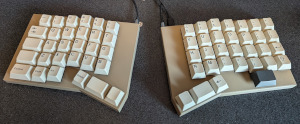
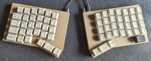
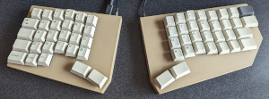
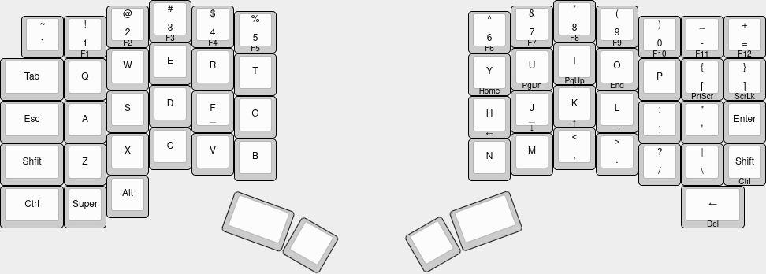
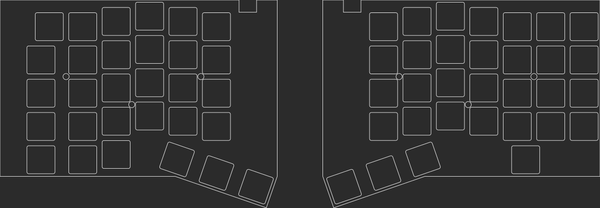
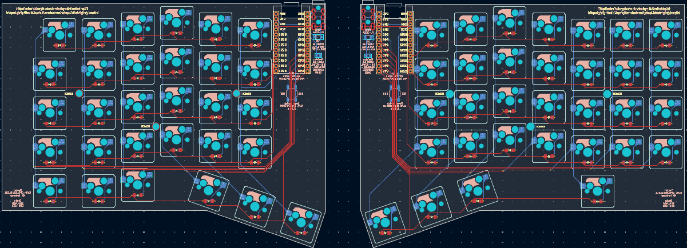

# Splinter keyboard

A 62-key split columnar ergonomic keyboard.

This repo holds the hardware design files; firmware lives in a [separate repo](https://github.com/andornaut/qmk_firmware/tree/splinter/keyboards/splinter). Design pipeline: Keyboard Layout Editor -> Ergogen -> KiCad -> fabrication -> Onshape -> OrcaSlicer -> QMK (see [Developing](#developing)).

Related notes: [3D printing](https://github.com/andornaut/til/blob/master/docs/3d-printing.md), [electronics](https://github.com/andornaut/til/blob/master/docs/electronics.md), [keyboards](https://github.com/andornaut/til/blob/master/docs/keyboards.md).

## Versions

| Version | MCU | Changes from previous | Firmware | Photo |
| --- | --- | --- | --- | --- |
| [v4](./v4) | [splitkb Liatris](https://splitkb.com/products/liatris) (RP2040) | Added USB VBUS detection and TRRS data-line protection | [splinter](https://github.com/andornaut/qmk_firmware/tree/splinter/keyboards/splinter) | Pending |
| [v3](./v3) | [Adafruit KB2040](https://www.adafruit.com/product/5302) (RP2040) | Switched from AVR to RP2040 | [splinter-v3.0](https://github.com/andornaut/qmk_firmware/tree/splinter-3.0/keyboards/splinter) | [](./v3/v3.jpg) |
| [v2](./v2) | [SparkFun Pro Micro](https://www.sparkfun.com/products/15795) (ATmega32U4) | Symmetrical enclosures; added a key (62 keys) | [splinter-v2.0](https://github.com/andornaut/qmk_firmware/tree/splinter-2.0/keyboards/splinter) | [](./v2/v2.jpg) |
| [v1](./v1) | [SparkFun Pro Micro](https://www.sparkfun.com/products/15795) (ATmega32U4) | Initial version: 61 keys, columnar layout, asymmetrical enclosures | [splinter-v1.0](https://github.com/andornaut/qmk_firmware/tree/splinter-1.0/keyboards/splinter) | [](./v1/v1.jpg) |

## Repository layout

Every version directory (`v1/` .. `v4/`) follows the same shape, though not every version has every part:

| Path | Contents |
| --- | --- |
| `ergogen/config.yaml` | Keyboard definition. The source of truth for everything downstream. |
| `ergogen/footprints/` | Symlink to the shared footprints below, so every version builds against one pinned set. Do not edit. |
| `keyboard-layout-editor/` | Layout prototypes. |
| `kicad/unrouted/` | Working boards. Ergogen generates into these; you route here. |
| `kicad/routed/` | Routed masters. The fab source. |
| `kicad/unrouted-backups/` | Timestamped copies of the `unrouted/` boards, taken each time fresh ones overwrite them. Gitignored, and only the last few per board are kept. |
| `kicad/jlcpcb-parts.json` | LCSC part numbers, kept outside the `.kicad_pcb` so they survive regeneration. v4 only, and what makes assembly files appear. |
| `onshape/` | Case design. v1 to v3 keep their exported STEP here. v4 commits none, carrying the build sheet, the rationale, and a script that builds the same design as geometry; generate or export to `dist/`. |
| `orcaslicer/` | Slicer projects. v2 and v3 only. |

Shared across versions:

| Path | Contents |
| --- | --- |
| `ergogen/` | Footprints and helpers. |
| `scripts/` | Build steps. |
| `dist/` | Build output. Generated, not committed. |

A `_` prefix on a PCB filename excludes it from every step.

## Installation

| Tool | Needed for |
| --- | --- |
| [KiCad 10](https://www.kicad.org) | Routing, and `kicad-cli` for gerber export and headless DRC |
| [Node.js](https://nodejs.org) | Ergogen and the npm scripts |
| [Python 3](https://www.python.org) | The build steps (stdlib only; `pcbnew` comes from KiCad) |
| [OrcaSlicer](https://github.com/SoftFever/OrcaSlicer) | Slicing the printed case |
| [Freerouting](https://github.com/freerouting/freerouting) | Optional, for [autorouting](#autorouting-optional) |
| [KiKit](https://github.com/yaqwsx/KiKit) | Optional, for [panelization](#panelization-optional-for-pcba-cost); needs the git-master build |

```bash
# Include submodules when cloning
git clone --recursive git@github.com:andornaut/splinter-keyboard.git
cd splinter-keyboard

# Install the Node version from .nvmrc, then the deps (including Ergogen)
nvm install
npm install

# Install KiCad 10 (provides kicad-cli, used for fab file generation)
sudo add-apt-repository ppa:kicad/kicad-10.0-releases
sudo apt install kicad

# Fallback only if you cloned without --recursive
git submodule update --init --recursive
```

OrcaSlicer, KiCad, Freerouting and KiKit also install from [these Ansible tasks](https://github.com/andornaut/ansible-ctrl/blob/main/roles/hobbies/tasks/main.yml) (tags `orcaslicer`, `kicad`, `freerouting`; KiKit comes with `kicad`).

**Updating footprint submodules.** `npm run ergogen` uses `ceoloide` and `infused-kim` at their pinned revision and never advances them, so builds stay reproducible. To re-pin:

```bash
git submodule update --remote ergogen/footprints/ceoloide ergogen/footprints/infused-kim
git add ergogen/footprints/ceoloide ergogen/footprints/infused-kim
git commit -m "Bump footprint submodules"
```

## Commands

Run everything through `npm run` from the repo root: the scripts read the active version from `config.VERSION` in [`package.json`](./package.json).

| Command | Does |
| --- | --- |
| `pipeline` | The full build, every gate in order. The normal entry point. Add `-- -v` for the full log. |
| `ergogen` | Generate outlines and PCBs into `dist/${VERSION}/ergogen/` |
| `watch` / `watch:sync-unrouted` | Re-run `ergogen` on every `config.yaml` change, the second also copying into `unrouted/` |
| `copy:dist-to-unrouted` | `dist/` -> `unrouted/` (backs the old boards up to `unrouted-backups/` first) |
| `copy:traces-to-unrouted` | Traces and teardrops from `routed/` back into `unrouted/` |
| `copy:unrouted-to-routed` | `unrouted/` -> `routed/` (see [Saving to routed/](#saving-to-routed)) |
| `fab` | Gerbers, drill, and assembly BOM/CPL via `kicad-cli` |
| `panelize` | Combine both halves into one JLCPCB panel (optional) |
| `route` | Autoroute `unrouted/` via Freerouting (optional) |
| `validate:provenance` / `validate:symmetry` / `validate:firmware` / `validate:fab` | The four gates (see [Validation](#validation)) |
| `clean` | Remove `dist/` |

## Developing

### Step 1. Configure

Set `config.VERSION` in [`package.json`](./package.json) to `v1`, `v2`, `v3`, or `v4`, by editing the file or with `npm pkg set config.VERSION=v4`.

### Step 2. [Keyboard Layout Editor](http://www.keyboard-layout-editor.com/)



Prototype a layout, export it to [`keyboard-layout-editor.json`](./v4/keyboard-layout-editor/keyboard-layout-editor.json) so you can re-import and iterate, then use it as the basis for the Ergogen design.

### Step 3. [Ergogen](https://github.com/ergogen/ergogen)



1. `docker compose up` starts the Ergogen GUI (it builds on first run); open <http://ergogen.internal> (needs [docker_etc_hosts](https://github.com/andornaut/docker_etc_hosts) for the `/etc/hosts` entry).
1. Paste in, edit, then download [`ergogen/config.yaml`](./v4/ergogen/config.yaml).
1. `npm run ergogen`, then `npm run copy:dist-to-unrouted`. Or just `npm run watch:sync-unrouted`.

* The GUI renders no PCBs and is client-side only. Edit there, copy back to `config.yaml` (the source of truth), build with `npm run ergogen`.
* The browser cannot load footprints from disk, so the [`Dockerfile`](./Dockerfile) bakes this repo's [custom footprints](./ergogen/footprints/) into the GUI image. An unregistered `what:` shows up as unknown; after adding one, `docker compose build --no-cache`.

### Step 4. [KiCad](https://www.kicad.org/)



Open a board from [`kicad/unrouted/`](./v4/kicad/unrouted/) and route it. Before saving:

* **Add teardrops** (Edit > Edit Teardrops, nothing selected for board-wide): stronger pad and via joints. Re-run after any reroute.
* **Run DRC** (Inspect > Design Rules Checker, "Refill all zones" checked): clear every violation and unrouted net. `npm run fab` re-runs it headlessly, but fixing it here beats reading the JSON.
* **Check copper and silk** visually: no isolated GND islands or stranded pads; silk clear of pads and the board edge.

After regenerating with Ergogen, `npm run copy:traces-to-unrouted` brings the traces and teardrops from `routed/` back into `unrouted/` (then File > Revert in KiCad).

#### Saving to routed/

`npm run copy:unrouted-to-routed` writes the masters' `.kicad_pro` and `.kicad_dru` first, since the stages that move copper measure against the clearances those hold. Then, one master at a time, it copies the working board onto its master in [`kicad/routed/`](./v4/kicad/routed/) and runs:

| Stage | What it does |
| --- | --- |
| GND pour | Floods a ground plane on whichever side costs less (scored per board, F.Cu vs B.Cu) |
| Cleanup | Strips copper no route uses: dangling tracks and the vias they strand, tracks buried in pads, redundant vias, split segments |
| Pattern snap | Pulls strays onto the repeated shape they belong to, within a per-endpoint cap |
| Sliver tidy | Collapses any segment left shorter than it is wide, within a per-endpoint cap |

One master at a time, copy included, because any stage can stop the build: a master this run has not reached yet is still the routed board it was, rather than an un-poured working copy that nothing downstream would catch.

The last three stages feed each other: a collapsed sliver can leave a run the next snap recognises, and a snap leaves fragments for the next cleanup to merge and can leave a sliver of its own. So they repeat until a pass changes nothing, and a board still changing on the last allowed pass stops the build instead of shipping a master its own tooling has not finished with.

The working boards keep the stripped copper, mainly the footprints' unused `include_traces_vias` stubs, since a later reroute may pick it up.

Pattern snap and sliver tidy move copper rather than only removing it, so both are capped and both stop the build rather than guess:

* **Pattern snap.** The matrix is a grid, so most of the routing is one motif repeated, and hand-drawn copies land a fraction of a millimetre apart. DRC never sees it, because each copy is individually legal. Anything beyond the cap is a routing decision rather than a stray, so it is reported and left alone.
* **Sliver tidy.** Moving one end of a run pivots the whole run, so a collapse is refused if it exceeds the cap or would swing copper into another net's clearance or a keepout. The refusal names the sliver and the reason; close it in KiCad by dragging the two runs together, or by re-routing clear of the named area.

#### Autorouting (optional)

KiCad has no built-in autorouter. `npm run route` routes the [`unrouted/`](./v4/kicad/unrouted/) boards in place via [Freerouting](https://github.com/freerouting/freerouting), leaving `routed/` untouched; expect to hand-clean the result, then File > Revert. Raising via cost trades vias for *unrouted nets*, so it cannot beat hand-routing on via count.

| Env var | Default | Values |
| --- | --- | --- |
| `FREEROUTING_PASSES` | 100 | |
| `FREEROUTING_STRATEGY` | greedy | greedy, global, hybrid |
| `FREEROUTING_SELECTION` | prioritized | prioritized, random, sequential |
| `FREEROUTING_VIA_COST` | 50 | higher = fewer vias |
| `FREEROUTING_UNDESIRED_DIR_COST` | unset | cost of routing against a layer's preferred direction |
| `FREEROUTING_LOG_LEVEL` | WARN | ERROR, WARN, INFO, DEBUG, TRACE |

### Step 5. Fabrication (JLCPCB)

`npm run fab` exports from `routed/` into `dist/${VERSION}/kicad/jlcpcb/<name>/`:

| Output | Contents |
| --- | --- |
| `<name>-gerber.zip` | Gerbers and drill: the bare PCB |
| `<name>-BOM.csv`, `<name>-CPL.csv` | Assembly files, written only when [`jlcpcb-parts.json`](./v4/kicad/jlcpcb-parts.json) is present |
| `<name>-drc.json` | Headless DRC report, written per board before that board's export. Any error-level violation or unrouted net stops the run there, so a failing board never overwrites its own last-good gerbers. |

A provenance check gates the whole run before any board is touched, so a master that drifted from `config.yaml` produces nothing at all.

Which parts JLCPCB places and which you hand-solder is version-specific; see the [v4 notes](./v4/README.md#fabrication-jlcpcb).

**Ordering** from [JLCPCB](https://jlcpcb.com/): upload each `<name>-gerber.zip`, plus the matching BOM and CPL for assembly. Check placement in the [DFM viewer](https://cart.jlcpcb.com/quote/gerberviewThree); fix a mis-oriented part via its `rotation` in [`jlcpcb-parts.json`](./v4/kicad/jlcpcb-parts.json) and re-run.

#### Panelization (optional, for PCBA cost)

`npm run panelize` combines `left` and `right` into one panel so JLCPCB's per-order assembly setup and stencil fees are paid once instead of twice: worth it for PCBA orders, skip it for bare boards. Outputs to `dist/${VERSION}/kicad/jlcpcb/panel/`; the per-half `fab` remains the strict DRC gate. Requires [KiKit](https://github.com/yaqwsx/KiKit) (git-master build for KiCad 10); point it at an interpreter with `KIKIT_PYTHON`.

### Step 6. [Onshape](https://cad.onshape.com)

1. Create a document and start a sketch.
1. Select "Insert a DXF or DWG file" > "Import ..." (bottom of the dialog) > `dist/${VERSION}/ergogen/outlines/full_unfilleted.dxf`. That is the nominal hull rather than the fabricated edge: the fillet only removes material, so a pocket cut to the hull can never come out undersized.
1. Design the case to [`onshape/BUILD.md`](./v4/onshape/BUILD.md), which carries every dimension and the feature-by-feature recipe, then export `*.step` files to `dist/${VERSION}/onshape/`. They are build output and are not committed, so a stale one cannot sit in the repo looking like the thing to order.
1. For a cross-check, `freecadcmd v4/onshape/gen-case.py` builds the same design from the same sheet and writes verified STEPs to the same place.

### Step 7. [OrcaSlicer](https://github.com/SoftFever/OrcaSlicer)

1. Open or create a project and import the `*.step` files from `dist/${VERSION}/onshape/`.
1. Slice and print the case.
1. Install an [M2.5 heat-set insert](https://cnckitchen.store/products/gewindeeinsatz-threaded-insert-m2-5-standard-100-stk-pcs) into each mounting boss with a soldering iron, then clamp the PCB with the [M2.5 screws](./v4/README.md#bill-of-materials-bom).

#### Alternative: machined aluminium case (JLCCNC)

Upload each half's `*.step` to [JLCCNC](https://jlccnc.com) (left and right are separate mirrored parts, so set quantity per file):

| Setting | Value |
| --- | --- |
| Material | 6061 aluminium (JLCCNC's standard alloy) |
| Surface finish | Bead blasting + matte anodizing; drop the bead blasting for a glossier sheen. Black is the safe color. |
| Tolerance | Default (ISO 2768 medium) |
| Threaded holes | Tap the M2.5 holes directly; the heat-set inserts are for the printed case only |

A STEP file cannot carry threads, so model each hole at the ~2.05mm tap-drill diameter and upload a PDF with an `M2.5x0.45` callout and depth. Every hole shares the thread spec, but not the depth: the two bosses a switch recess overlaps take a shallower hole, so call the depths out per boss from the [build sheet](./v4/onshape/BUILD.md#screw-bosses). In Onshape, a Drawing with a hole callout (right-click the hole edge > Callout) emits it.

### Step 8. [QMK firmware](https://qmk.fm/)

Install the [custom QMK firmware](https://github.com/andornaut/qmk_firmware/tree/splinter/keyboards/splinter).

## Automation

### One-command pipeline

`npm run pipeline` re-syncs already-routed boards after a config change:

| # | Step | Does |
| --- | --- | --- |
| 1 | `ergogen` | Rebuild the boards from `config.yaml` |
| 2 | `copy:dist-to-unrouted` | Fresh boards into `unrouted/`, old ones backed up |
| 3 | `copy:traces-to-unrouted` | Replay the masters' routing onto them |
| 4 | `copy:unrouted-to-routed` | Save back to `routed/` ([details](#saving-to-routed)) |
| 5 | `validate:provenance` | Stamps match `config.yaml` |
| 6 | `validate:symmetry` | The halves are exact mirror images |
| 7 | `validate:firmware` | Boards match the QMK matrix |
| 8 | `fab` | Export gerbers and assembly files |
| 9 | `validate:fab` | Audit those outputs |

Every step is a hard gate. `panelize` runs last and is the only optional one, skipped with a note when KiKit is absent.

A step reports what it changed and what wants reading; lines that only confirm nothing needed doing are held back, since each step's closing `OK:` line already carries the count they would have added up to. `npm run pipeline -- -v` shows them all, plus Ergogen's own narration and the artifact listing file by file.

**It requires existing routed masters** and does not route for you: step 3 replays their traces onto the fresh boards and aborts if a master carries no human routing. For a first route, or when geometry moves enough that the old traces no longer fit, route by hand in KiCad (Step 4).

### Validation

| Gate | Checks |
| --- | --- |
| `validate:provenance` | Every board's stamp still matches `config.yaml`, and the boards in a stage were all built in the same run, so neither a stale master nor a half restored on its own can reach fab |
| `validate:symmetry` | The two halves are exact mirror images: outline, parts, pads, rule areas and silk, compared in each board's own frame so the per-board recentering is not read as asymmetry |
| `validate:firmware` | Both halves wire the MCU header identically, and the matrix they imply equals the QMK `keyboard.json` |
| `validate:fab` | The exported artifacts: a board-spanning GND plane on both master and gerbers, a complete gerber set, a non-empty BOM and CPL with every assembled footprint appearing in the CPL exactly once, outputs no older than their sources, comparable teardrop counts across the halves |

`validate:fab` also warns, without failing, when a master was built from an uncommitted tree: the board is fine, but its recorded commit means nothing, so the warning is expected during ordinary in-progress work.

`validate:symmetry` holds the halves to being exact mirrors of each other. The licensed exception is the keys of the outer pinky columns, which differ by design (the left pinky is 1.5u; the right is 1u plus an extra inner column). Drift here is otherwise invisible: both halves still route, pass DRC, fab and assemble, and it surfaces only as a case that fits one half and rocks on the other, or a clearance that is comfortable on one half and marginal on the other. Both halves are generated from one set of mirrored anchors in `config.yaml`, so a failure is a config change to undo rather than a board to edit.

Three kinds of part are placed in the same orientation on both halves rather than mirrored, because the parts themselves cannot be: an MX switch and its Kailh socket have an asymmetric pin pattern, the matrix diode wires straight to a switch pin and follows it, and the MCU is a module that plugs in one way up. Their pads therefore land at mirrored positions carrying the opposite pin at each. Key *placements* still mirror exactly, and so does every clearance measured from key geometry; only pad-to-edge distances within a key differ between the halves. Hand routing is not compared at all.

`validate:firmware` reads the `keyboard.json` at `config.FIRMWARE` in [`package.json`](./package.json), which ships as a path to a sibling `qmk_firmware` checkout so the check covers what you are about to flash rather than what is pushed. Without that checkout the step fails and no gerbers are produced; pass `--firmware <URL>` or set `$SPLINTER_FIRMWARE_JSON` instead.

### Provenance stamp

The copy steps and manual routing let `routed/` drift from `config.yaml`, so you could fab a stale board. `npm run ergogen` stamps each board with a hash of `config.yaml`; `fab` refuses a drifted or unstamped master, and `validate:provenance` checks without fabbing. Clear a mismatch by re-running the pipeline, re-routing if needed.

Restoring or rebuilding one half on its own is invisible to the hash, since identical config bytes hash the same across builds, so `validate:provenance` also requires every board in a stage to carry the same stamp. The two stages are compared separately: `unrouted/` is expected to be newer than `routed/` between an `ergogen` run and the save back to the masters.

A panel inherits its masters' stamp rather than getting one of its own, so its `commit=` names the commit the panelled copper came from. Masters whose stamps disagree stop `panelize`, since a panel merged from two generations of board has no single provenance to report.

Only `config.yaml` is hashed, so a footprint `.js` or Ergogen-version change can move geometry without tripping the check, while a comment-only config edit trips a false "stale".

### Reproducing a previous build

A stamp names the commit the build's *inputs* came from, never the commit that contains the stamped board: the stamp is written into the board, so it can only name its own parent. To get the boards a stamp describes, check that commit out and rebuild.

```bash
git checkout <the commit= from the stamp>
npm run pipeline
```

Taking `kicad/routed/*.kicad_pcb` straight from that commit instead gives you the *previous* build's masters. Rebuilding reproduces copper, drill, mask, paste, outline and the assembly files identically; only the `built=` timestamp drawn on the silk and a few microns of teardrop fill tessellation differ.
