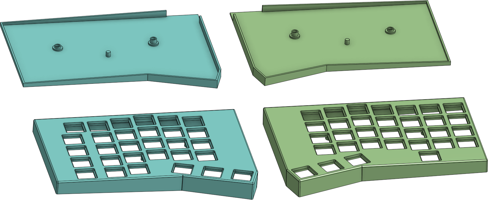

# Splinter keyboard

A 62-key split columnar ergonomic keyboard

* [QMK firmware](https://github.com/andornaut/qmk_firmware/tree/splinter/keyboards/splinter)
* [andornaut@github /til](https://github.com/andornaut/til/)
  * [3D Printing](https://github.com/andornaut/til/blob/master/docs/3d-printing.md)
  * [Electronics](https://github.com/andornaut/til/blob/master/docs/electronics.md)
  * [Keyboards](https://github.com/andornaut/til/blob/master/docs/keyboards.md)

## Versions

Version | Description | Firmware | Layout
--- | --- | --- | ---
[v3](./v3) | 62-keys. Symmetrical enclosures. Non-traditional placement of backspace and backslash keys. | [tags/splinter-v3.0](https://github.com/andornaut/qmk_firmware/tree/splinter-3.0/keyboards/splinter) | [](./v3/v3.jpg)
[v2](./v2) | 62-keys. Symmetrical enclosures. Non-traditional placement of backspace and backslash keys. | [tags/splinter-v2.0](https://github.com/andornaut/qmk_firmware/tree/splinter-2.0/keyboards/splinter) | [](./v2/v2.jpg)
[v1](./v1) | 61-keys. Asymetrical enclosures. Traditional layout. | [tags/splinter-v1.0](https://github.com/andornaut/qmk_firmware/tree/splinter-1.0/keyboards/splinter) | [](./v1/v1.jpg)

## Installation

* [Ergogen](https://github.com/ergogen/ergogen)
  * [Footprints by ceoloide](https://github.com/ceoloide/ergogen-footprints)
  * [Footprints by infused-kim](https://github.com/infused-kim/kb_ergogen_fp)
  * [Footprints by sboysel](https://github.com/sboysel/ergogen/tree/develop/src/footprints)
  * [Helper scripts](https://github.com/infused-kim/kb_ergogen_helper)
* [KiCad](https://www.kicad.org)
  * [KiKit automation tools](https://github.com/yaqwsx/KiKit)
* [OrcaSlicer](https://github.com/SoftFever/OrcaSlicer)

```bash
# Include submodules when cloning
git clone --recursive git@github.com:andornaut/splinter-keyboard.git
cd splinter-keyboard

# Install dependencies, including Ergogen
nvm use
npm install

# Install KiCad
sudo add-apt-repository ppa:kicad/kicad-8.0-releases
sudo apt install kicad

# Install KiKit
# Must use the same Python interpreter as KiCad (will not work in a venv)
sudo pip install kikit --break-system-packages

# Update submodules
git submodule update --recursive --remote
```

Alternatively, you can install OrcaSlicer and Kicad using [these Ansible tasks](https://github.com/andornaut/ansible-ctrl/blob/master/roles/dev/tasks/hobbies.yml).

## Developing

### Step 1. Configure the environment

Set the `VERSION` environment variable in [`.env`](./.env) to one of v1, v2, or v3

### Step 2. [Keyboard Layout Editor](http://www.keyboard-layout-editor.com/)


1. Prototype a keyboard layout using [Keyboard Layout Editor](http://www.keyboard-layout-editor.com/)
1. Export the layout configuration to [`keyboard-layout-editor/keyboard-layout-editor.json`](./v3/keyboard-layout-editor/keyboard-layout-editor.json), so that you can import it and iterate on it in the future
1. Use the prototype as inspiration for creating a production-ready design using Ergogen

### Step 3. [Ergogen](https://github.com/ergogen/ergogen)

* [Online version of Ergogen that includes ceoloide's footprints](https://ergogen.ceoloide.com/)


1. Convert the prototype to a production-ready design using [Ergogen](https://github.com/ergogen/ergogen), and then save it to [`ergogen/config.yaml`](./v3/ergogen/config.yaml)
   * If prototyping using this [online Ergogen editor](https://ergogen.ceoloide.com/), then click the gear icon, then add the [sod-123w footprint](./ergogen/footprints/sod-123w.js)
1. Run `npm run build` to generate and save outlines and pcbs to `../dist/v3/ergogen/` then `npm run copy-pcbs-to-kicad`
    * Alternatively, run `npm run watch` or `npm run watch-and-copy-pcbs-to-kicad`

### Steps 4. [KiCad](https://www.kicad.org/)


1. Design the PCBs using [KiCad](https://www.kicad.org/)
1. Run `npm run copy-pcbs-to-kicad` to copy the `../dist/v3/ergogen/pcbs/*.kicad_pcb` files generated by Ergogen to [`kicad/`](./v3/kicad/)
1. Run `xdg-open ./v3/kicad/left.kicad_pcb`
1. Route the PCBs in [`kicad/`](./v3/kicad/), and then save them to [`kicad/routed/`](./v3/kicad/routed/)
   * Once you're happy with the routing, run `npm run copy-pcbs-to-routed` to copy the PCBs to [`kicad/routed/`](./v3/kicad/routed/)
   * If you've generated new PCB files using Ergogen, then you can run `npm run copy-traces-from-routed` to copy traces from the PCBs in [`kicad/routed/`](./v3/kicad/routed/) back to those of the same name in [`kicad/`](./v3/kicad/). Select File > Revert > Yes to refresh the PCB in Kicad.
1. Run `npm run copy-pcbs-to-routed && npm run fab-jlcpcb` to generate and save gerber and drill files to `../dist/v3/kicad/jlcpcb/*.zip`
1. Print the PCBs using [JLCPCB](https://jlcpcb.com/) (or [OSH Park](https://oshpark.com/) or [PCBWay](https://www.pcbway.com/))
   * Submit the `../dist/v3/kicad/jlcpcb/*.zip` files to [JLCPCB](https://jlcpcb.com/)

#### Customize net classes

1. Navigate to File > Board Setup... > Design Rules > Net Classes
1. Update the "Default" netclass
1. Click the "+" button to add a "VCC" net class
1. Configure a pattern to match nets with the text "VCC" to the VCC net class

Configuration | Description
--- | ---
Default | Clearance: 0.20mm, Track width: 0.20mm
VCC | Clearance: 0.25mm, Track width: 0.25mm

#### Fix error when running `npm run build`

The `pcbnew` Python library, which is packaged with Kicad,
may fail if it cannot find libTKBO, eg.:

```bash
$ python3
Python 3.12.3 (main, Apr 10 2024, 05:33:47) [GCC 13.2.0] on linux
Type "help", "copyright", "credits" or "license" for more information.
>>> import pcbnew
Traceback (most recent call last):
  File "<stdin>", line 1, in <module>
  File "/usr/lib/python3/dist-packages/pcbnew.py", line 12, in <module>
    import _pcbnew
ImportError: libTKBO.so.7: cannot open shared object file: No such file or directory
```

Workaround this issue by installing the missing library:

```bash
sudo apt install libocct-modeling-algorithms-7.6t64
```

### Step 5. [OnShape](https://cad.onshape.com)



1. Model the case using [OnShape](https://cad.onshape.com)
1. Create a new document
1. Start a new sketch
1. Select "Insert a DXF or DWG file" > "Import ..." (at the bottom of the dialog) > Select `../dist/v3/ergogen/outlines/full.dxf`
1. Design a keyboard case
1. Export `*.step` files to [`onshape/`](./v3/onshape/)

### Step 6. [OrcaSlicer](https://github.com/SoftFever/OrcaSlicer)

1. Print the case using [OrcaSlicer](https://github.com/SoftFever/OrcaSlicer)
1. Open or create an OrcaSlicer project file
1. Import `*.step` files from [`onshape/`](./v3/onshape/)
1. Print the keyboard case

### Step 7. [QMK Firmware](https://qmk.fm/)

1. Install the [custom QMK firmware](https://github.com/andornaut/qmk_firmware/tree/splinter/keyboards/splinter)
