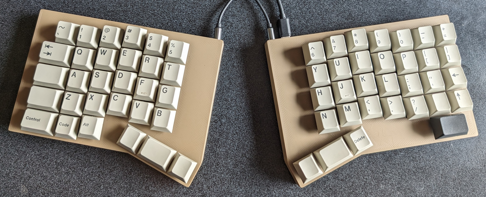

# Version 2 of the Splinter keyboard

* [QMK firmware](https://github.com/andornaut/qmk_firmware/tree/splinter-2.0/keyboards/splinter)

A 62-key split columnar ergonomic keyboard - Symmetrical enclosures.
Non-traditional placement of backspace and backslash keys.

## Hardware

### Bill of materials (BOM)

Category | Quantity | Part
--- | --- | ---
Diodes | 62 | [Nexperia BAS16H,115](https://www.lcsc.com/product-detail/Switching-Diode_Nexperia-BAS16H-115_C130413.html)
Hot swap sockets | 62 | [Kailh CPG151101S11-16](https://www.lcsc.com/product-detail/Mechanical-Keyboard-Shaft_span-style-background-color-ff0-Kailh-span-CPG151101S11-16_C5156480.html)

Description | Quantity | Part
--- | --- | ---
Diodes | 62 | [Nexperia BAS16H,115](https://www.lcsc.com/product-detail/Switching-Diode_Nexperia-BAS16H-115_C130413.html)
Hot swap sockets | 62 | [Kailh CPG151101S11-16](https://www.lcsc.com/product-detail/Mechanical-Keyboard-Shaft_span-style-background-color-ff0-Kailh-span-CPG151101S11-16_C5156480.html)
Keycap set | 1 | [GMK Sixes keycaps](https://www.deskhero.ca/products/gmk-sixes) and [Ortho Kit](https://www.deskhero.ca/products/gmk-sixes?variant=39360309329986)
Key switches | 62 | [Cherry MX Ergo Clear](https://shockport.ca/collections/switches-1/products/cherry-mx-ergo-clear) ([developer information](https://www.cherrymx.de/en/dev.html))
Microcontrollers | 2 | [SparkFun Qwiic Pro Micro - USB-C (ATmega32U4)](https://www.sparkfun.com/products/15795) ([GitHub](https://github.com/sparkfun/Pro_Micro?tab=readme-ov-file)) (Note that [some USB-C Pro Micros are 3mm longer](https://keeb.io/products/pro-micro-usb-c-version-5v-16mhz-arduino-compatible-atmega32u4) than the Micro-USB version that the Ergogen footprint is based on, but this is not true of the [SparkFun USB-C Pro Micro](https://www.sparkfun.com/products/15795))
Reset buttons | 2 | [E-Switch TL3342F450QG](https://www.lcsc.com/product-detail/Tactile-Switches_E-Switch-TL3342F450QG_C2886897.html) (Not needed if using the SparkFun microcontroller)
Screws | 4 | [M3x12mm screws](https://www.amazon.ca/gp/product/B01MZ3TWAF/)
Silicon bumpers | 8 | [100Pcs Self Adhesive Round Silicone Rubber Bumpers](https://www.aliexpress.com/item/1005003258243932.html)
Sockets (12-pin) | 4 | [Mill-Max 315-43-112-41-003000](https://www.mouser.ca/ProductDetail/575-3154311241003000)
Socket pins | 48 | [Mill-Max 3320-0-00-15-00-00-03-0](https://www.mouser.ca/ProductDetail/575-3320000150000030)
Threaded inserts | 4 | [M3x3mm (short) threaded inserts](https://cnckitchen.store/products/gewindeeinsatz-threaded-insert-m3-short-100-stk-pcs)
TRRS cables | 1 | [Monoprice Onyx TRRS Cable](https://www.monoprice.com/product?p_id=18632)
TRRS jacks | 2 | [HCTL HC-PJ-320A-4P-D](https://www.lcsc.com/product-detail/Audio-Connector-Headphone_HCTL-HC-PJ-320A-4P-D_C5372851.html)

#### Part dimensions

Part | Dimensions
--- | ---
[Keycap size](https://cdn.matt3o.com/uploads/2018/05/keycap-size-diagram.png) | 18mm²
[SparkFun Qwiic Pro Micro - USB-C (ATmega32U4)](https://www.sparkfun.com/products/15795) | PCB: width: 17.78mm, length: 33.02; USB: protrusion: 1.27mm
Keycap size with padding | 19mm²
PCB thickness | 1.6mm
Switch (MX) cutout size | 14mm²
Switch (MX) outer size | 15.6mm²

### Microcontroller

* [Pro Micro pinout](https://golem.hu/article/pro-micro-pinout/)

Left Arduino | Left AVR | Right Arduino | Right AVR
---      |--- | ---      |---
1 (TX0)  | D3 | RAW      ||
0 (RX1)  | D2 | GND      ||
GND      |    | RST      ||
GND      |    | VCC      ||
2 (SDA)  | D1 | A3 (21)  | F4
3 (SCL)  | D0 | A2 (20)  | F5
4 (A6)   | D4 | A1 (19)  | F6
5        | C6 | A0 (18)  | F7
6 (A7)   | D7 | 15       | B1
7        | E6 | 14       | B3
8 (A8)   | B4 | 16       | B2
9 (A9)   | B5 | 10 (A10) | B6
