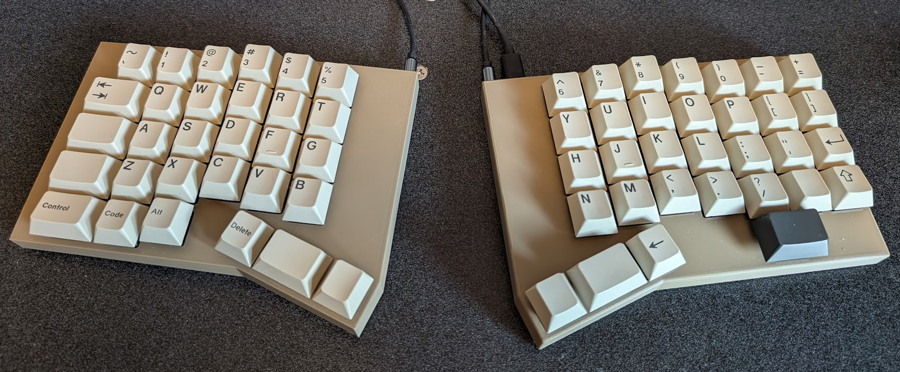

# Version 3 of the Splinter keyboard

* [QMK firmware](https://github.com/andornaut/qmk_firmware/tree/splinter-3.0/keyboards/splinter)

A 62-key split columnar ergonomic keyboard - Symmetrical enclosures.
Non-traditional placement of backspace and backslash keys.

## Hardware

### Bill of materials (BOM)

Description | Quantity | Part
--- | --- | ---
Diodes | 62 | [Nexperia BAS16H,115](https://www.digikey.ca/en/products/detail/nexperia-usa-inc/BAS16H-115/1163692)
Hot swap sockets | 62 | [Kailh CPG151101S11-16](https://www.lcsc.com/product-detail/Mechanical-Keyboard-Shaft_span-style-background-color-ff0-Kailh-span-CPG151101S11-16_C5156480.html)
Keycap set | 1 | [GMK Sixes keycaps](https://www.deskhero.ca/products/gmk-sixes) and [Ortho Kit](https://www.deskhero.ca/products/gmk-sixes?variant=39360309329986)
Key switches | 62 | [Cherry MX Ergo Clear](https://shockport.ca/collections/switches-1/products/cherry-mx-ergo-clear) ([developer information](https://www.cherrymx.de/en/dev.html))
Microcontrollers | 2 | [Adafruit KB2040 - RP2040 Kee Boar Driver](https://www.digikey.ca/en/products/detail/adafruit-industries-llc/5302/15794634) or [SparkFun Pro Micro - RP2040](https://www.digikey.ca/en/products/detail/sparkfun-electronics/18288/15216111)
Screws | 2 | [M3x8mm screws](https://www.amazon.ca/1021Pcs-Stainless-Assortment-Machinery-Furniture/dp/B0B292QDWG)
Screws | 2 | [M3x10mm screws](https://www.amazon.ca/1021Pcs-Stainless-Assortment-Machinery-Furniture/dp/B0B292QDWG)
Silicon bumpers | 8 | [10x2mm Silicone Rubber Bumpers](https://www.aliexpress.com/item/1005005315398342.html)
Sockets (12-pin) | 4 | [Mill-Max 315-43-112-41-003000](https://www.mouser.ca/ProductDetail/575-3154311241003000) ([Series documentation](https://mm.digikey.com/Volume0/opasdata/d220001/medias/docus/2481/310%2C%20311%2C%20315%20Series%20%28in.%29.pdf))
Socket pins | 48 | [Mill-Max 3320-0-00-15-00-00-03-0](https://www.mouser.ca/ProductDetail/575-3320000150000030)
Switches/buttons | 2 | [E-Switch TL3342F450QG](https://www.digikey.ca/en/products/detail/e-switch/TL3342F450QG/4029404)
Threaded inserts | 4 | [M3x5x4 threaded inserts](https://cnckitchen.store/products/made-for-voron-gewindeeinsatz-threaded-insert-m3x5x4-100-stk-pcs)
TRRS cables | 1 | [Monoprice Onyx TRRS Cable](https://www.monoprice.com/product?p_id=18632)
TRRS jacks | 2 | [HCTL HC-PJ-320A-4P-D](https://www.lcsc.com/product-detail/Audio-Connector-Headphone_HCTL-HC-PJ-320A-4P-D_C5372851.html)

### Part dimensions

Part | Dimensions
--- | ---
[Keycap size](https://cdn.matt3o.com/uploads/2018/05/keycap-size-diagram.png) | 18mm²
[Adafruit KB2040 - RP2040 Kee Boar Driver](https://www.adafruit.com/product/5302) | 35.0mm × 17.8mm × 4.9mm
[SparkFun Pro Micro - RP2040](https://www.sparkfun.com/sparkfun-pro-micro-rp2040.html) | 33.02mm × 17.78 mm,  USB protrusion: 1.27mm
Keycap size with padding | 19mm²
PCB thickness | 1.6mm
Switch (MX) cutout size | 14mm²
Switch (MX) outer size | 15.6mm²
